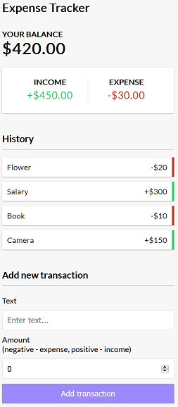

On my way to learn ReactJS



## Features

In this project I used :

* React Hooks
* Context API

#### React Hooks Example

```javascript
import React from 'react'

export const Transaction = ({ transaction }) => {

    const sign = transaction.amount < 0 ? '-' : '+'
    return (
        <li className={transaction.amount < 0 ? 'minus' : 'plus'}>
            {transaction.text} <span>{sign}{Math.abs(transaction.amount)}</span><button className="delete-btn">x</button>
        </li>
    )
}
```
#### Context API

```javascript
import React, { createContext, useReducer } from 'react';
import AppReducer from './AppReducer'

//Initial State
const initialState = {
    transactions: [
        { id: 1, text: 'Flower', amount: -20 },
        { id: 2, text: 'Salary', amount: 300 },
        { id: 3, text: 'Book', amount: -10 },
        { id: 4, text: 'Camera', amount: 150 }
    ]
}

// Create Context
export const GlobalContext = createContext(initialState);

// Provider component

const GlobalProvider = ({ children }) => {
    const [state, dispatch] = useReducer(AppReducer, initialState);
    return (<GlobalContext.Provider value={{ transactions: state.transactions }}>{children}</GlobalContext.Provider>)
}

export default GlobalProvider;
```

